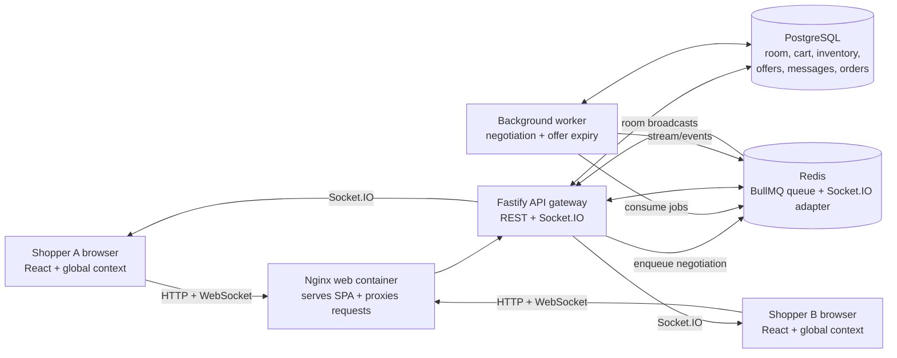

# Good Company — Multiplayer AI Deal Room

A real-time co-shopping demo where two invited shoppers use one shared cart, chat with a mock AI concierge, unlock a short-lived bundle offer, and check out together. The frontend is a Vite + React single-page app; the API, background worker, PostgreSQL, Redis, and web server run as separate Docker Compose services.

> **Demo scope:** Shopper IDs and payment are simulated. There is no real login, payment provider, or paid AI service. The project demonstrates the architecture and flows in the assessment, rather than production-grade identity or payment processing.

## Features

- Shared cart updates broadcast to all connected shoppers in a room through Socket.IO.
- PostgreSQL transactions serialize checkout, verify the cart version, reserve inventory once, record a simulated order, and emit `Checkout_Complete` after commit. An idempotency key protects retries.
- Chat requests are saved by the API and submitted to BullMQ in Redis. A separate worker waits ten seconds, then streams a deterministic mock response to the whole room.
- The queued concierge answers from live PostgreSQL room state: product descriptions/prices/stock, catalog counts, the shared cart and totals, active offers, invited room members, recent chat, and the latest simulated order. It uses deterministic keyword/intent rules and never calls a paid AI API.
- A worker checks PostgreSQL for expired offers and removes them from the active room state without relying on browser timers. It broadcasts `Offer_Expired` when an offer expires.
- Socket.IO reconnects automatically; the browser reloads the room snapshot from the API to restore the cart, products, active offer, recent chat, and latest order.
- Docker Compose starts the web server, API/WebSocket gateway, background worker, PostgreSQL, and Redis.

## Architecture



### Shared cart and checkout

```mermaid
sequenceDiagram
    participant A as Shopper A
    participant API as Fastify + Socket.IO
    participant DB as PostgreSQL
    participant B as Shopper B

    A->>API: Add item / change quantity
    API->>DB: Lock room; update cart and version
    DB-->>API: Commit
    API-->>A: HTTP result
    API-->>B: cart_updated over Socket.IO
    A->>API: Checkout with cart version + idempotency key
    B->>API: Checkout at nearly the same time
    API->>DB: Lock room and inventory rows
    Note over API,DB: First valid checkout commits one order and stock deduction.
    API->>DB: Reject stale cart version on competing checkout
    DB-->>API: Commit / conflict
    API-->>A: Checkout_Complete
    API-->>B: Checkout_Complete
```

The room lock and cart version ensure that competing checkout requests cannot both purchase the same shared cart. A request based on an outdated cart version receives a conflict and must refresh. Payment is represented by a database order with `simulated_paid`; no charge is made.

### Concierge, streaming, and expiring offers

```mermaid
sequenceDiagram
    participant User as Either shopper
    participant API as Fastify API
    participant Q as Redis / BullMQ
    participant Worker as Background worker
    participant DB as PostgreSQL
    participant Room as Both room browsers

    User->>API: Send concierge message
    API->>DB: Save user message
    API->>Q: Enqueue negotiation job
    API-->>User: 202 Accepted
    Worker->>Q: Consume job
    Note over Worker: Simulate negotiation for 10 seconds
    Worker->>DB: Save reply; create eligible offer
    Worker-->>Room: Stream response chunks + offer_created
    Note over Worker,DB: Every second, worker checks DB server time for expiration.
    Worker->>DB: Deactivate expired offer and advance room version
    Worker-->>Room: Offer_Expired + cart_updated
```

## Run with Docker Compose

### Requirements

- Docker Desktop (or Docker Engine) running.
- Docker Compose v2 (`docker compose` command).
- Ports `5173`, `3000`, and `5433` available on the host. PostgreSQL's host port can be changed in `.env`.

### 1. Clone and enter the repository

Clone this repository from GitHub, then open a terminal in the cloned `multiplayer-ai-deal-room-co-shopping` folder.

### 2. Create your local environment file

Copy the committed example file:

```powershell
Copy-Item .env.example .env
```

On macOS/Linux, use `cp .env.example .env` instead. Edit `.env` and replace the example password everywhere it appears: `POSTGRES_PASSWORD`, `DATABASE_URL`, and `PGADMIN_DATABASE_URL`. Use a simple URL-safe value (letters and numbers) so it works in the connection URLs in the file. Keep `.env` private; Git ignores it.

The example config uses:

| Setting | Value / purpose |
| --- | --- |
| `POSTGRES_DB` | `dealroom`, the database created by Compose |
| `POSTGRES_USER` | `dealroom`, the database user created by Compose |
| `POSTGRES_PASSWORD` | Set this locally in `.env` |
| `POSTGRES_HOST_PORT` | `5433`, the port for optional host tools such as pgAdmin |
| `DATABASE_URL` | Container-to-container API connection; uses Compose service name `postgres` |
| `PGADMIN_DATABASE_URL` | Optional host-side connection URL; defaults to `localhost:5433` |
| `REDIS_URL` | Container-to-container Redis connection; uses Compose service name `redis` |
| `FRONTEND_ORIGIN` | Allowed browser origin; local Compose defaults to `http://localhost:5173` |

The `postgres` and `redis` hostnames work inside the Compose network. For pgAdmin on your computer, use host `localhost`, port `5433`, database `dealroom`, user `dealroom`, and the password you set. The `PGADMIN_DATABASE_URL` entry shows the same connection as a URL.

### Environment variables for a Vercel + Render deployment

The Nginx proxy is only used by the local Docker Compose web container. For a split deployment, configure these values in the provider dashboards:

| Provider | Variable | Value |
| --- | --- | --- |
| Render API | `FRONTEND_ORIGIN` | The Vercel site origin, for example `https://your-project.vercel.app` (origin only: no path or trailing slash). Multiple exact origins can be comma-separated. |
| Render API | `DATABASE_URL` | The connection URL copied from Neon. |
| Render API | `REDIS_URL` | The TLS/TCP Redis URL copied from Upstash, typically starting with `rediss://`. Use the Redis TCP connection details, not the REST URL. |
| Vercel frontend | `VITE_API_BASE_URL` | The Render service URL plus `/api`, for example `https://your-api.onrender.com/api`. |
| Vercel frontend | `VITE_SOCKET_URL` | The Render service origin, for example `https://your-api.onrender.com` (no `/api`). |

Vite embeds `VITE_` values into the browser bundle at build time, so they are public URLs, not secret storage. The frontend derives its REST API origin from `VITE_SOCKET_URL` when provided, keeping API and Socket.IO pointed at the same backend. `VITE_API_BASE_URL` is the fallback for an API-only remote setup. Redeploy the Vercel project after changing these values. Keep database credentials and Redis credentials only in Render's environment settings. The frontend defaults to relative `/api` and same-origin Socket.IO when these Vite variables are absent, preserving local Docker/Nginx behavior.

For Render's Docker service form, select **Docker**, leave Root Directory blank, and leave Dockerfile Path and Docker Context blank (their defaults use the repository-root `Dockerfile` and context). Leave native Node build/start command fields unused; Render builds the Dockerfile and runs its `CMD`. The Docker image listens on Render's injected `PORT` (default `10000`). The image's default command starts the API and worker as separate processes together for a free Web Service deployment. Docker Compose overrides that command to keep them in separate local services.

### 3. Build and start all services

Make sure Docker Desktop is running, then run:

```sh
docker compose up --build
```

The first build may take a few minutes. PostgreSQL creates the schema and sample room/products; the API also applies idempotent schema updates on startup. Wait until the `api`, `worker`, and `web` services are running.

### 4. Open and try the app

- App: [http://localhost:5173](http://localhost:5173)
- API health: [http://localhost:3000/api/health](http://localhost:3000/api/health)

The seeded room is `ROOM-9001`, with demo shoppers `U-101` and `U-102`. Use the two-avatar button in the app to switch shopper identity. For a multiplayer check, open the app in two browser windows and select a different shopper in each. Add an item in one window and confirm it appears in the other.

The concierge is a keyword-driven mock that reads the current product catalog, stock, and shared bag from PostgreSQL after the queued job's ten-second negotiation delay. Try asking it to describe a product, compare the catalog, count products or out-of-stock items, or summarize the shared bag. Responses are streamed to both shoppers through Socket.IO; no paid AI API is used.

Offers are also mocked and scoped to the item they discount. Add the required quantity, then ask for a deal on that product: two Titanium Pro laptops unlock 20% off, two Wireless Ergonomic Mice unlock 15% off, one 4K Ultra-Wide Monitor unlocks 10% off, one Studio Mechanical Keyboard unlocks 15% off, one Compact USB-C Dock unlocks 12% off, one pair of Studio Noise-Canceling Headphones unlocks 15% off, and one 4K Desk Webcam unlocks 10% off. Each code expires in three minutes according to the backend. Checkout validates the active code, target product, and required quantity inside its database transaction.

### 5. Stop or reset the stack

Stop containers with `Ctrl+C`, or from another terminal run:

```sh
docker compose down
```

PostgreSQL and Redis data live in named Docker volumes and remain after `down`. To remove the volumes and reset the demo database and Redis data completely:

```sh
docker compose down -v
```

Then run `docker compose up --build` again.

Useful commands:

```sh
docker compose ps
docker compose logs -f api worker
```

## Repository layout

```text
.
├── src/                    # React SPA, global room state, and styles
├── server/
│   ├── index.js             # Fastify API, Socket.IO gateway, and room events
│   ├── worker.js            # BullMQ negotiation worker and offer expiry sweep
│   ├── queue.js             # BullMQ queue and Redis connection
│   ├── db.js                # PostgreSQL connection pool
│   └── schema.sql           # Tables, idempotent migrations, and demo seed data
├── docker-compose.yml       # PostgreSQL, Redis, API, worker, and web services
├── Dockerfile               # Production web build and Node service images
├── nginx.conf               # SPA hosting and API/WebSocket reverse proxy
├── .env.example             # Safe starter environment configuration
└── .gitignore               # Local secrets and generated files excluded from Git
```

## Notes

- The API uses the `x-user-id` header and verifies membership against the seeded room. This is a demo identity check, not user authentication.
- Only `ROOM-9001` and the seven sample products are seeded by default. Seed inserts add new product IDs on startup but do not overwrite existing product rows or stock; deleting Compose volumes resets the sample stock and data.
- No external AI or payment API is called. The concierge reply and payment result are mocked locally.
